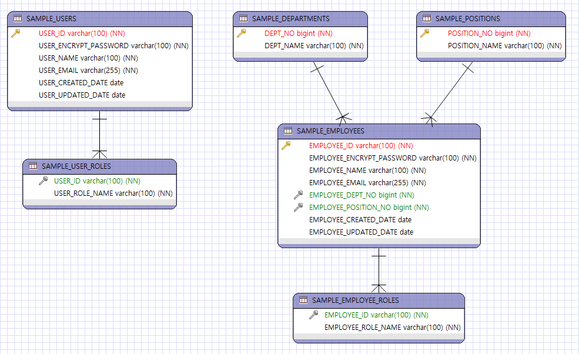

# 스프링 시큐리티로 인증처리 구현

- 사용자, 직원, 관리자별로 로그인한 화면을 제공하고, 일괄적으로 로그인 처리를 수행하는 샘플 프로젝트다.

## 개발환경

구분| 버전 
---- | ------- 
java | 17
spring boot | 2.6.7
database | h2

## 샘플 데이터베이스
- 샘플 데이터베이스는 사용자 테이블, 사용자 보유권한 테이블, 부서 테이블, 직위 테이블, 직원 테이블, 직원 보유권한 테이블로 구성된다.
- h2 데이터베이스를 사용하며, 애플리케이션 실행시 자동으로 테이블 생성되고 샘플 데이터가 저장된다.
- 테이블 스키마와 샘플 데이터는 /src/resources 폴더의 schema.sql과 data.sql로 확인할 수 있다.

### ER 다이어그램

## 구현내용
- 사용자, 직원, 관리자를 구분해서 로그인 화면이 제공된다.
- 사용자, 직원, 관리자는 로그인이 완료되면 각각 사용자 홈화면, 직원 홈화면, 관리자 홈화면으로 이동한다.
- 사용자, 직원, 관리자는 로그인이 실패하면 해당 로그인 화면에 오류 메세지가 표시된다.
- 사용자로 등록하면 USER 권한이 부여된다.
- 직원으로 등록하면 MPLOYEE 권한이 부여된다.
- 관리자는 등록화면을 제공하지 않는다.
- 사용자는 사용자 기능만 사용할 수 있다.
- 직원은 직원 기능만 사용할 수 있다.
- 관리자는 사용자, 직원, 관리자 기능을 사용할 수 있다.

### 요청 URI

요청 URI | 내용 | 인증여부 | 필요권한
---- | ---- | ---- | ----
/ | 홈 화면 요청 | N | 없음
/user/register | 사용자 가입화면 요청 | N | 없음
/user/registered | 사용자 가입완료 화면 요청 N | 없음
/emp/register | 직원 가입화면 요청 | N | 없음
/emp/registered | 직원 가입완료 화면 요청 N | 없음
/user/login | 사용자 로그인 화면 요청 |N | 없음
/emp/login | 직원 로그인 화면 요청 |N | 없음
/admin/login | 관리자 로그인 화면 요청 |N | 없음
/login | 사용자, 직원, 관리자 로그인 요청 처리 |N | 없음
/logout | 로그아웃 요청 | Y | 없음
/user/home | 사용자 홈 화면 요청 | Y | USER 권한, ADMIN 권한
/emp/home | 직원 홈 화면 요청 | Y | EMPLOYEE 권한, ADMIN 권한
/emp/admin | 관리자 홈 화면 요청 | Y | ADMIN 권한

## 주요 클래스

